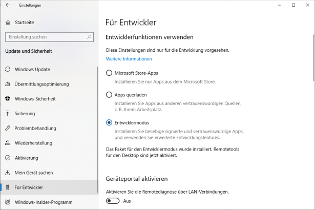

.. _developer_guide:

Developer's Guide
=================

Installing eFLIPS as a GIT submodule
------------------------------------

If you are actively involved in eFLIPS development, you will most likely face the following usage scenario:

#. You are working in your own GIT repository containing scripts for your simulation activities.
#. You wish to use the package ``eflips`` as well as any other packages containing operator-specific functionality in your scripts, using simple ``import xyz`` statements.
#. You wish to be able to modify ``eflips`` code from within your IDE's main project environment, i.e. without switching between several project environments.
#. You wish to conveniently pull and push ``eflips`` code from/to its own repository at ``https://github.com/mpm-tu-berlin/eflips``.

We can achieve this using a combination of GIT submodules and symbolic links (symlinks). The following tutorial walks you through creating a GIT repository of your own, configuring ``eflips`` as a submodule and creating symbolic links to include it in the module search path.

First, if using Windows 10, make sure to enable Developer Mode in *Settings > For Developers > Developer Mode*:

    Enabling developer mode in Windows 10

Otherwise, you will require admin privileges to create symlinks.

Now, create a GIT repository on your platform of choice. For this example, we create a repository called ``test-project``. Make a local clone of the repository **and enable symlink support**:

.. code-block:: none

    D:\GIT> git clone --config core.symlinks=true <url_to_repository>

Add a ``.gitignore`` file to the newly created folder. :ref:`This modified GitHub template <gitignore_template>` works perfectly for us. Then, commit and push:

.. code-block:: none

    D:\GIT\test-project> git add .
    D:\GIT\test-project> git commit -m "Initial commit"
    D:\GIT\test-project> git push -u origin master

If you already have a GIT repository, you can enable symlink support by editing the ``.git/config`` file to include:

.. code-block:: none

    [core]
        symlinks = true

Now, include ``eflips`` as a GIT submodule in your own repository, **but be sure to clone it into an** ``eflips-git`` **folder**:

.. code-block:: none

    D:\GIT\test-project> git submodule add https://github.com/mpm-tu-berlin/eflips.git eflips-git

You may notice the actual ``eflips`` Python package is now found in the ``test-project/eflips-git/eflips`` folder. However, we want it to appear on the top level, otherwise it won't be within the module search path (unless we fiddle around with ``sys.path.append()`` at the top of every script - no thanks...). This is where symbolic links come into play. Create a **relative** symlink using:

.. code-block:: none

    D:\GIT\test-project> mklink /D eflips "eflips-git\eflips"

We have now have a top-level ``eflips`` folder that redirects to the actual folder deeper down the tree. Now, you could commit and push again:

.. code-block:: none

    D:\GIT\test-project> git add .
    D:\GIT\test-project> git commit -m "Added eflips submodule and symlink"
    D:\GIT\test-project> git push

Symbolic links are committed to the GIT repository and preserved when cloning the repository *(provided the user enables symbolic links as shown above)*.

If you now create a project in your favourite IDE with ``test-project`` as the root folder, opening a console and typing

.. code-block:: none

    import eflips

should yield success, provided you have installed all of ``eflips``'s dependencies into your Python environment. A ``requirements.txt`` file is provided for this. Assuming you have already installed a Python virtual environment into a ``venv`` subfolder of your ``test-project``, invoke:

.. code-block:: none

    D:\GIT\test-project\venv\Scripts> pip install -r ..\..\eflips\requirements.txt

If you have not yet created the virtual environment, create it using:

.. code-block:: none

    C:\Program Files\Python38> python -m venv "D:\GIT\test-project\venv"

Use this procedure - including a submodule and symlinking to the desired package path - with any other package that you wish to contribute to. Calling GIT from the respective submodule folders pulls from and pushes to the correct repository, e.g., calling

.. code-block:: none

    D:\GIT\test-project-eflips-git> git pull

will update ``eflips`` from its origin at ``https://github.com/mpm-tu-berlin/eflips``, no matter where your ``test-project`` is hosted.