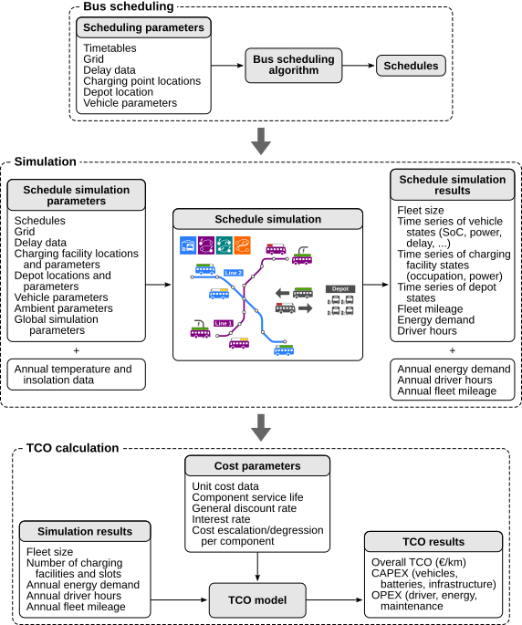

Introduction
============

Welcome to eFLIPS (Electric Fleet and Infrastructure Planning/Simulation), a Python package developed at `MPM @ Technical University Berlin <https://www.mpm.tu-berlin.de/menue/home/>`_ to facilitate the planning of fleet electrification projects. eFLIPS is mainly tailored toward bus fleet electrification, but it can be applied to any transport network that operates on the basis of fixed schedules. At MPM, we have applied it to urban and long-distance bus networks, refuse collection vehicles and battery-electric trains.

Use Cases
---------

The package consists of a fleet simulation, a scheduling algorithm, a TCO calculation module and an optimisation algorithm for en-route charging infrastructure locations. It lends itself to several use cases:

* Simulation of existing vehicle schedules (usually designed for diesel vehicles) with electric vehicles to assess their electrification potential.
* Planning of new schedules adapted to electric vehicles' range and charging time constraints to serve existing timetables; simulation of the schedules to obtain energy consumption, fleet size, driver hours, number of charging points etc. for full electrification.
* Determination of cost-optimised charging locations for opportunity charging (end-stop charging).
* Annual or lifetime energy consumption calculation for fleets considering the seasonal variation in ambient temperature.
* Total cost of ownership (TCO) calculation for electric vehicle fleet.

All of these use cases are covered in our paper `A Comprehensive TCO Evaluation Method for Electric Bus Systems Based on Discrete-Event Simulation Including Bus Scheduling and Charging Infrastructure Optimisation <http://dx.doi.org/10.3390/wevj11030056>`_, available as an Open Access publication. If you are unsure if eFLIPS is the right tool for you, we suggest reading the paper.

Workflow
--------

The typical workflow to create a fully electric scenario is pictured in the following figure. The charging location optimisation algorithm is not pictured as it "wraps around" the entire workflow: Simply speaking, the algorithm executes all three steps (scheduling, simulation, TCO calculation) for any number of possible charging location combinations and chooses the solution with the lowest TCO.

    General eFLIPS workflow (not including charging location optimisation). Source: `Jefferies and Göhlich, 2020 <http://dx.doi.org/10.3390/wevj11030056>`_

A Note on Code Quality
----------------------

eFLIPS was developed by a team [ToDo: insert link] of researchers with energy engineering, electrical engineering and mechanical engineering backgrounds - no computer scientists! While we generally consider the code quality "good enough" to be released to the public, we are not exactly proud of it, either. Aside from several design decisions that sometimes over-complicate the code or impede performance, the handling of exceptions is particularly worthy of improvement. Some of the documentation is also not 100% complete. Nonetheless, we believe that code generated in publicly funded research projects belongs in the public domain, hence our decision to publish. Please bear with the code; if you have any questions, please don't hesitate to contact us. (For some amusing thoughts on this matter, check Matthew Might's `CRAPL license <http://matt.might.net/articles/crapl/>`_.)

License
-------

Let's see...